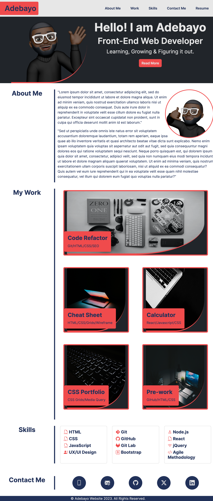
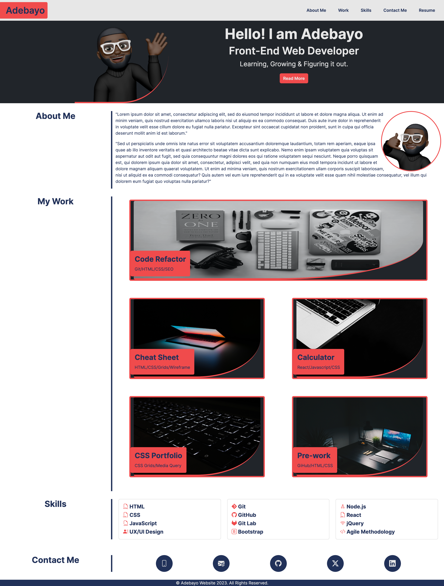

# 03-bootstrap-portfolio

# Bootstrap Demo Portfolio Page

## Description
Made Demo Portfolio Webiste using Bootstrap. Using knowledge from the weeks teaching, created the elements/structures individulaly to re-enforce knowledge. 

## Summary of Changes
Page made in accordance to the acceptance criteria.
- When the page is loaded the page presents the name Adebayo, an avatar, and links to sections About Me, My Work, Skills and Contact Me Info.
- When one of the links in the navigation is clicked, the UI scrolls to the corresponding section.
- The hero section is a jumbotron featuring my picture, name, titles and motto.
- When viewing the section about my work, it is displaying my work in grid and the section contains titled images of my applications. And a short description of the skills used.
- When presented with the first application the application's image is larger in size than the others.
- When images of the applications are clicked, the user is taken to that deployed application.
- A skills section that lists out some of the skills I'll learn from the bootcamp.
- Contact section - Relevant links displayed using Icons and have a hover effect that display a box shadow upon hover.
- When the page is resized or viewed on various screens and devices then the layout is responsive and adapts to common viewport.

## Demo Portfolio Page
The following images shows the Bootstrap Demo Portfolio Page appearance in different device sizes and showcasing functionailty.

> **Note** This is a video of the deployed demo portfolio page showing functionality.

> **Note** This is a screenshot of the Demo Portfolio Page on an Iphone 14 Pro Max.

> **Note** This is a screenshot of the Demo Portfolio Page on an iPad Pro.

> **Note** This is a screenshot of the Demo Portfolio Page at 1700px.

## License
Licensed under the MIT License

## GitHub Repository
URL: https://github.com/adebayoadebisi/03-bootstrap-portfolio  

## Deployed Web Application
URL: https://adebayoadebisi.github.io/03-bootstrap-portfolio/ 